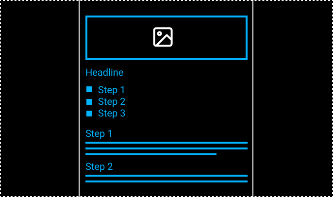

## Create a simple recipe page


Use the `````` tag and store your image in a seperate folder. Use a ```<ol>``` ordered list for your cooking steps.

As a stretch goal, use [this technique](https://www.w3docs.com/snippets/html/how-to-create-an-anchor-link-to-jump-to-a-specific-part-of-a-page.html) to create anchor links within your document. A click on e.g. step 2 in the list would bring me directly to the cprresponding full description of that step.
