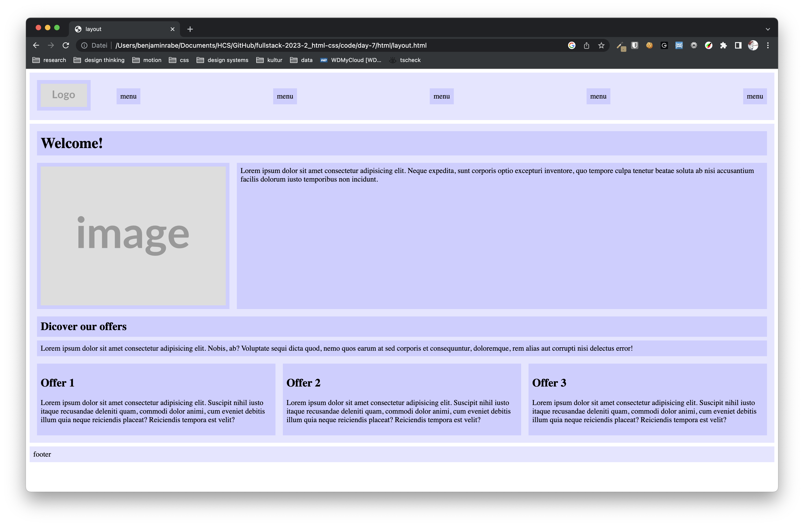

## build this layout

Start with creating tasks, step by step, working from the outside to the inside, adding details step by step.

I uploaded it [here](https://nonuts.de/hcs/html/layout.html) for you to see the behaviour. I trust you to not just copy and paste ^\_^
